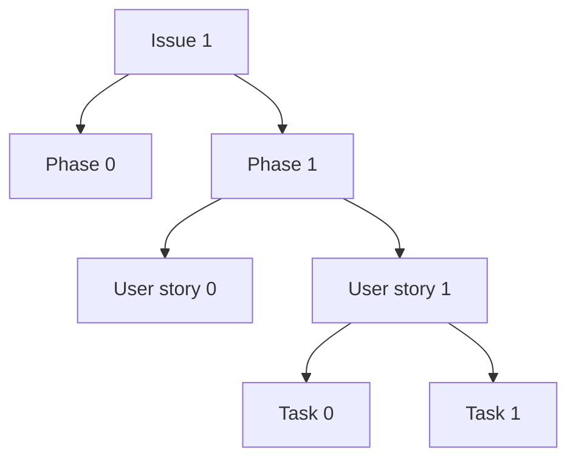

# labs 375 — stac-fastapi-geoparquet

[](https://github.com/developmentseed/labs-375-stac-geoparquet-backend/actions/workflows/ci.yml)

We've built a [service](https://github.com/stac-utils/stac-fastapi-geoparquet) to search [stac-geoparquet](https://github.com/stac-utils/stac-geoparquet) with a STAC API [query](https://api.stacspec.org/v1.0.0/item-search/).
A development version is available at <https://stac-geoparquet.labs.eoapi.dev/>.

> [!WARNING]
> This project was a science experiment, and will not be actively maintained after April 2025.
> These instructions and code will bitrot and fall out-of-date.
> We preserve them in case they're useful to future adventurers.

## Usage

Get [uv](https://docs.astral.sh/uv/getting-started/installation/), then:

```shell
git clone git@github.com:developmentseed/labs-375-stac-geoparquet-backend.git
cd labs-375-stac-geoparquet-backend
uv sync --all-groups
```

Our "katas" live in [docs/katas](./docs/katas).
These are notebooks that exercise **stac-fastapi-geoparquet** and **stac-fastapi-pgstac** and report performance metrics.

### CDK

We use the AWS [Cloud Development Kit (CDK)](https://aws.amazon.com/cdk/) for Infrastructure-as-Code (IaC).
The code is located in [infrastructure/aws](./infrastructure/aws/).
See [Releasing and deploying](#releasing-and-deploying) for how we normally do deploys.

During development, you might want to run `cdk` yourself.
First, [install it](https://docs.aws.amazon.com/cdk/v2/guide/getting_started.html).
Then:

```shell
source .venv/bin/activate
cd infrastructure/aws
cp .env.local .env
# Make sure you're using the eoAPI sub-account
aws sso login --profile eoapi && eval "$(aws configure export-credentials --profile eoapi --format env)" # or however you configure your AWS sessions
cdk diff # to show any differences
```

## Releasing and deploying

Our deploys are triggered by Github releases (or by workflow dispatch, in a pinch).
To create a release:

```shell
scripts/release
```

This will create a draft release in Github and print its url to the console.
The release will target the current **main** branch.
Go to the Github URL, edit the release as you see fit, then publish it to trigger a deploy.
If you need to manually release, use the [Github releases interface](https://github.com/developmentseed/labs-375-stac-geoparquet-backend/releases) to cut one.

### Versioning

We use [CalVer](https://calver.org/) with the following scheme: `vYYYY.MM.DD.n`, where `n` is the release count for the day.
If you're releasing more than ten times in a day, stop, take a breath, and come back tomorrow.

## Project management

We love 🌳.
Almost everything's in a hierarchy:

- [Issue 1](https://github.com/developmentseed/labs-375-stac-geoparquet-backend/issues/6) is the tree root
- Under **Issue 1** there are several [phases](https://github.com/orgs/developmentseed/projects/140/views/1), which may run simultaneously
- Phases are composed of [User stories](https://github.com/developmentseed/labs-375-stac-geoparquet-backend/issues?q=is%3Aissue%20label%3A%22user%20story%22)
- Finally, tasks are the leaves.
  Tasks might live here, or they might be issues on other repos.



[Milestones](https://github.com/developmentseed/labs-375-stac-geoparquet-backend/milestones) are checkpoints and are used to group phases.
Bugs and one-off tasks can live outside of the hierarchy.

## Resources

- [Issue 1](https://github.com/developmentseed/labs-375-stac-geoparquet-backend/issues/6)
- [Project board](https://github.com/orgs/developmentseed/projects/140)
- [Proposal](https://docs.google.com/document/d/1xq3j5z2PT5HXHyFPCQFPplVnGHMeFWfjnp3wmp_kv24/edit?tab=t.0#heading=h.93utyws5dnx2)
- [Labs ticket](https://github.com/developmentseed/labs/issues/375)
