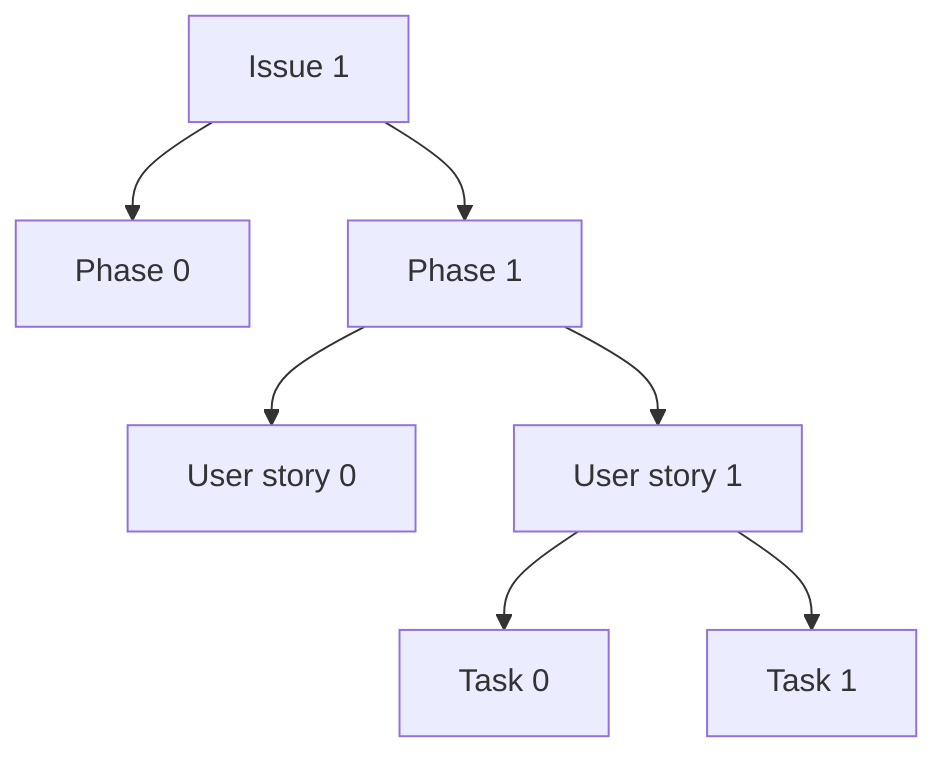

# stac-geoparquet API backend

We're going to build a service that searches a [stac-geoparquet](https://github.com/stac-utils/stac-geoparquet) file with a [STAC API item search query](https://api.stacspec.org/v1.0.0/item-search/), and compare its performance to the same service backed by [pgstac](https://github.com/stac-utils/pgstac) and [ElasticSearch](https://www.elastic.co/elasticsearch).

## Core assumptions

- Everything we build should either be in this repo or in an already-existing one ... we shouldn't stand up any new repos.
- We're _not_ going to use [stac-fastapi](https://github.com/stac-utils/stac-fastapi) or [stac-fastapi-pgstac](https://github.com/stac-utils/stac-fastapi-pgstac).
  We might end up porting over code or ideas later, but @gadomski wants this to be green-field.
- We want to be public-by-default (with appropriate throttling) with all of our services.
  We want to show this off to the world, not keep it secret.
- We'd like to use [stac-rs](https://github.com/stac-utils/stac-rs) (and its Python friends, [stacrs](https://github.com/gadomski/stacrs) and [pgstacrs](https://github.com/stac-utils/pgstacrs)) as much as possible.
  This is partially a sop to @gadomski, but we think that the performance and reusability benefits of Rust will be part of what makes this project special.
- APIs should be FastAPI, which is the de-facto standard here at Development Seed for good reason.

## Project management

We love 🌳.
Almost everything's in a hierarchy:

- [Issue 1](https://github.com/developmentseed/labs-375-stac-geoparquet-backend/issues/6) is the tree root
- Under **Issue 1** there are several [phases](https://github.com/orgs/developmentseed/projects/140/views/1), which may run simultaneously
- Phases are composed of [User stories](https://github.com/developmentseed/labs-375-stac-geoparquet-backend/issues?q=is%3Aissue%20label%3A%22user%20story%22)
- Finally, tasks are the leaves.
  Tasks might live here, or they might be issues on other repos.

[Milestones](https://github.com/developmentseed/labs-375-stac-geoparquet-backend/milestones) are checkpoints and are used to group phases.

## Resources

- [Issue 1](https://github.com/developmentseed/labs-375-stac-geoparquet-backend/issues/6)
- [Project board](https://github.com/orgs/developmentseed/projects/140)
- [Proposal](https://docs.google.com/document/d/1xq3j5z2PT5HXHyFPCQFPplVnGHMeFWfjnp3wmp_kv24/edit?tab=t.0#heading=h.93utyws5dnx2)
- [Labs ticket](https://github.com/developmentseed/labs/issues/375)
