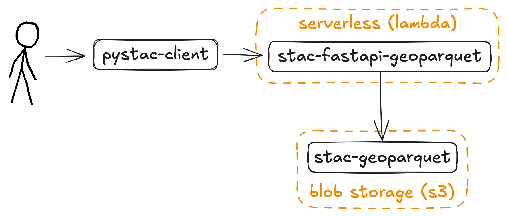
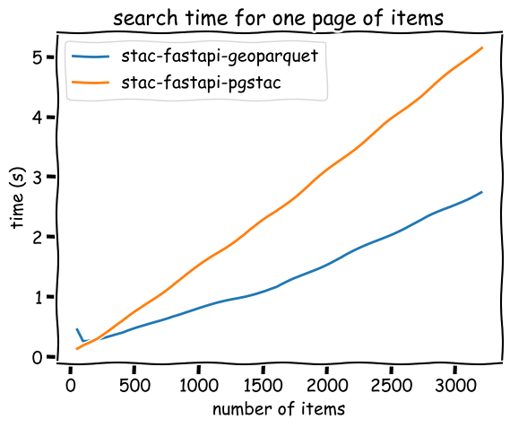
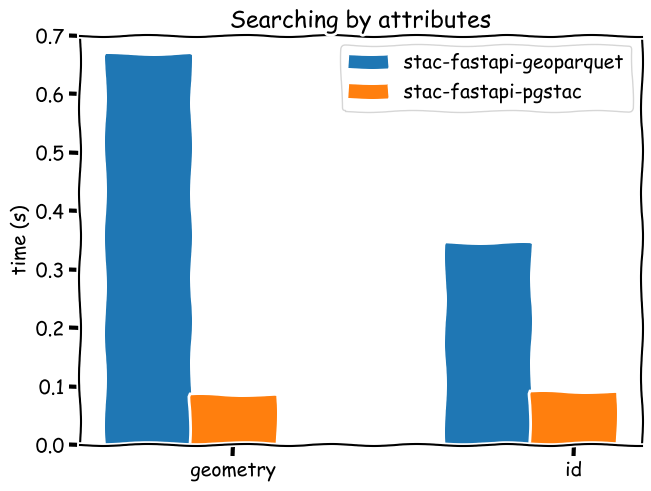

# Right-sizing STAC

[Cloud-Native Geospatial](https://guide.cloudnativegeo.org/) is a collection of specifications, tools, and ideas around how **geospatial data** can be queried, visualized, and analyzed from its storage location, without heavy infrastructure like a database or API server.
We're bringing the same philosophy to **geospatial metadata** via [stac-geoparquet](https://github.com/stac-utils/stac-geoparquet/blob/main/spec/stac-geoparquet-spec.md).
We hope that these new technologies and tools will provide more flexibility and efficiency in storing and querying metadata.

## What the STAC?

The [SpatioTemporal Asset Catalog (STAC)](https://stacspec.org) specification is a **common language to describe geospatial information**.
Built on battle-tested geospatial standards and specifications such as [GeoJSON](https://geojson.org/) and [OGC API - Features](https://ogcapi.ogc.org/features/), STAC has a vast (and growing) number of [implementations](https://stacindex.org/catalogs) with single instances containing over [hundreds of millions of items](https://developers.planet.com/blog/2022/Aug/31/state-of-stac/).
But STAC isn't just for large organizations and companies; it can be used in any system where geospatial assets need to be stored and indexed for later use by humans, machines, or interfaces.

Most existing [STAC API](https://github.com/radiantearth/stac-api-spec) backends use customized instances of existing data store systems, such as [pgstac (for PostgreSQL)](https://github.com/stac-utils/pgstac) or [Elasticsearch/OpenSearch](https://github.com/stac-utils/stac-fastapi-elasticsearch-opensearch).
Each of those backends support huge (>100 million items) instances, such as [Microsoft's Planetary Computer](https://planetarycomputer.microsoft.com/) or [AWS's Earth Search](https://earth-search.aws.element84.com/v1).
However, because these backends are designed to scale, they can be awkward to use for smaller datasets.
They can be expensive when deployed through a cloud provider's off-the-shelf services (<https://aws.amazon.com/rds/>), without even considering the cost of configuring and maintaining those backends.

> Postgres needs to be managed
>
> — @bitner

## Cloud-Native Geospatial Metadata

Enter [geoparquet](https://geoparquet.org/), a geospatial-specific flavor of the powerful column-oriented data format [parquet](https://parquet.apache.org/).
**geoparquet** is natively _queryable_, meaning that clients, such as [DuckDB](https://duckdb.org/), can search directly from a **geoparquet** file.
DuckDB has an officially supported [spatial extension](https://duckdb.org/docs/stable/extensions/spatial/overview.html) for doing precisely this.

```sql
D install spatial;
D load spatial;
D select * from read_parquet('s3://stac-fastapi-geoparquet-labs-375/naip.parquet')
  where st_intersects(geometry, st_geomfromgeojson('{"type":"Point","coordinates":[-105.1019,40.1672]}'));
┌─────────┬──────────────┬──────────────────────┬──────────────────────┬───────────────┬───┬───────────┬──────────────────────┬───────────┬──────────────────────┬──────────────────────┬──────────────────────┐
│  type   │ stac_version │   stac_extensions    │          id          │  proj:shape   │ … │ naip:year │      proj:bbox       │ proj:epsg │      providers       │         bbox         │       geometry       │
│ varchar │   varchar    │      varchar[]       │       varchar        │    int64[]    │   │  varchar  │       double[]       │   int64   │ struct(url varchar…  │ struct(xmin double…  │       geometry       │
├─────────┼──────────────┼──────────────────────┼──────────────────────┼───────────────┼───┼───────────┼──────────────────────┼───────────┼──────────────────────┼──────────────────────┼──────────────────────┤
│ Feature │ 1.1.0        │ [https://stac-exte…  │ co_m_4010556_sw_13…  │ [12240, 9550] │ … │ 2021      │ [489150.0, 4441434…  │   26913   │ [{'url': https://w…  │ {'xmin': -105.1274…  │ POLYGON ((-105.060…  │
├─────────┴──────────────┴──────────────────────┴──────────────────────┴───────────────┴───┴───────────┴──────────────────────┴───────────┴──────────────────────┴──────────────────────┴──────────────────────┤
│ 1 rows                                                                                                                                                                                 19 columns (11 shown) │
└──────────────────────────────────────────────────────────────────────────────────────────────────────────────────────────────────────────────────────────────────────────────────────────────────────────────┘
```

The only missing piece was to bridge the gap between STAC and **geoparquet**.
[Tom Augsburger](https://github.com/TomAugspurger) began work in [May 2022](https://github.com/stac-utils/stac-geoparquet/commit/8b39b72a5694ea08ec9aaeea37d53bf589969787) with an implementation that used a [GeoDataFrame](https://geopandas.org/en/stable/docs/reference/api/geopandas.GeoDataFrame.html) as an intermediate representation.
Since then, the original [stac-geoparquet](https://github.com/stac-utils/stac-geoparquet) code has matured to be more performant and support alternative storage mechanisms, including [Delta Lake](https://delta.io/).
In parallel, we've added an intuitive **stac-geoparquet** interface to [rustac](https://github.com/stac-utils/rustac-py), which binds more directly to the underlying Rust libraries such as [geoarrow-rs](https://github.com/geoarrow/geoarrow-rs/).

## But does it work?

Microsoft's Planetary Computer showed that [stac-geoparquet can be useful for bulk STAC item queries](https://planetarycomputer.microsoft.com/docs/quickstarts/stac-geoparquet/).
But we wondered if we could adapt **stac-geoparquet** to work with existing STAC tooling, such as [pystac-client](https://pystac-client.readthedocs.io/) or [stac-browser](https://radiantearth.github.io/stac-browser).
To do so, we built a prototype [stac-fastapi-geoparquet](https://github.com/stac-utils/stac-fastapi-geoparquet/) to put a "serverless" API layer in front of **stac-geoparquet**.



This architecture should be extremely affordable, since we're only utilizing light "serverless" services and blob storage.
To see if it worked, we ran a series of experiments where we compared **stac-fastapi-geoparquet** with a **stac-fastapi-pgstac** instance with the same data.
These results are preliminary, but encouraging.

### Results

Our benchmarks reveal a nuanced performance profile between [`stac-fastapi-geoparquet`](https://github.com/stac-utils/stac-fastapi-geoparquet) and [`stac-fastapi-pgstac`](https://github.com/stac-utils/stac-fastapi-pgstac), shaped by dataset size and query type.

For small to **medium-sized catalogs** (under approximately 100,000 items), `stac-fastapi-geoparquet` consistently outperforms `pgstac` when returning large pages of items. This makes it a strong choice for scenarios like paginated browsing or lightweight faceted search, particularly when operating in serverless environments or on a constrained budget.



However, for **targeted lookups** (e.g., retrieving a single STAC item by ID or matching on exact attributes), traditional databases like `pgstac` still shine. Their indexing and query planning provide much faster access times for "needle-in-a-haystack" searches.



**At large scales** (over approximately 2 million items), we reach the limits of our current serverless architecture. In particular, our Lambda deployment of `stac-fastapi-geoparquet` times out during single-item searches. This isn’t a fundamental limit of DuckDB or GeoParquet, but a practical boundary of compute limits in AWS Lambda. These limits highlight the need for thoughtful deployment strategies as data volumes grow.

These results demonstrate the promise of analyzing metadata "at rest" using simple, efficient tooling — but also highlight where robust databases or other scalable query systems still play a key role.
Cloud-native doesn't mean _no_ infrastructure — it means **choosing the right infrastructure** for the job.

### But do you need a server at all?

One of the compelling stories for Cloud-Native Geospatial (Meta)data is that they can be used without a server at all.
**rustac** can use the same STAC API search parameters (including [cql2](https://developmentseed.org/cql2-rs/)) to search the **stac-geoparquet** file directly, without going through a server at all:

```python
from rustac import DuckdbClient

client = DuckdbClient()
# Configure AWS credentials
client.execute("CREATE SECRET (TYPE S3, PROVIDER CREDENTIAL_CHAIN)")
items = client.search(
    "s3://stac-fastapi-geoparquet-labs-375/naip.parquet",
    intersects={"type": "Point", "coordinates": [-105.1019, 40.1672]},
)
```

## What's Next?

We're looking to take these experiments beyond our labs and into real-world applications.

If you're working with small- to medium-sized geospatial datasets — from thousands to a few hundred thousand assets — we’d love to explore how the free and open-source [`stac-fastapi-geoparquet`](https://github.com/stac-utils/stac-fastapi-geoparquet) can support your use case.

Curious about how we ran these tests and what we found? Dive into the details in our [labs repository](https://github.com/developmentseed/labs-375-stac-geoparquet-backend/).
